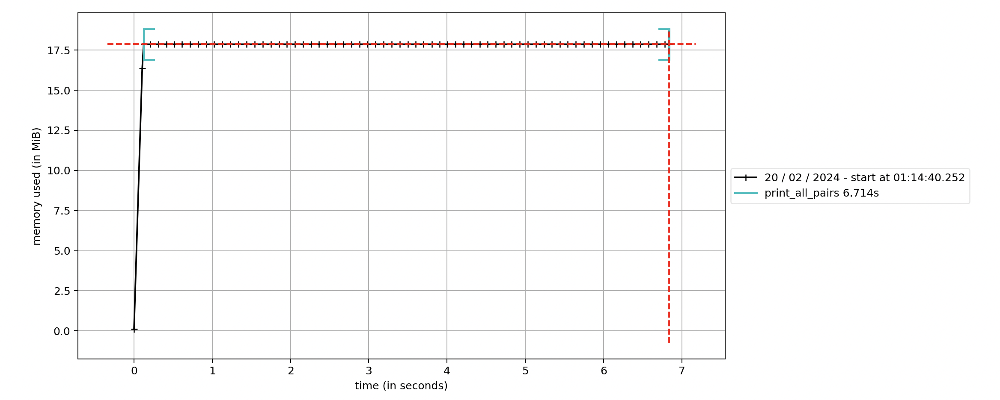

# Profiling Memory Usage with memory-profiler

No surprises as to what this chapter is about! We'll be using the RAM equivalent of `line-profiler`, called `memory-profiler`. But what we want from memory usage is less clear than CPU usage, and a bit of a Goldilock's scenario:

- we may want to reduce RAM usage for greater efficiency
- we may want to increase RAM usage, to save the number of CPU cycles required

I won't go into too much detail here, but in essence: memory allocation is expensive, so sometimes overallocating is better. 

Examining your code with `memory-profiler` adds quite a lot of overhead - to make it run faster, you'll also want to install `psutil`. For graphs, you'll need `matplotlib`. So, let's get them all from PyPI: `pip install memory-profiler psutil matplotlib`

We decorate our script as with `line-profiler`:

```python
import random

@profile
def print_all_pairs(numbers):
    n = len(numbers)
    for i in range(n):        
        for j in range(n):    
            print(numbers[i], numbers[j])

def generate_random_numbers(length):
    return [random.randint(1, 1000) for _ in range(length)]

random_numbers = generate_random_numbers(1000)
print_all_pairs(random_numbers)
```

To run it, we have two options:

1. **Getting tabular output from the terminal**

To do this, enter this (rather slow...) command:

```shell
python -m memory_profiler test.py
```

This will return a table showing how much RAM is added during the running of the script:

```shell
Line #    Mem usage    Increment  Occurrences   Line Contents
=============================================================
     3   17.977 MiB   17.977 MiB           1   @profile
     4                                         def print_all_pairs(numbers):
     5   17.980 MiB    0.004 MiB           1       n = len(numbers)
     6   17.984 MiB    0.000 MiB        1001       for i in range(n):
     7   17.984 MiB    0.000 MiB     1001000           for j in range(n):
     8   17.984 MiB    0.004 MiB     1000000               print(numbers[i], numbers[j])
```

2. **Plotting a graph over time**

You can use the bundled utility, `mprof`, for this:

```shell
mprof run test.py
mprof plot
```

Which will plot a graph similar to this:

