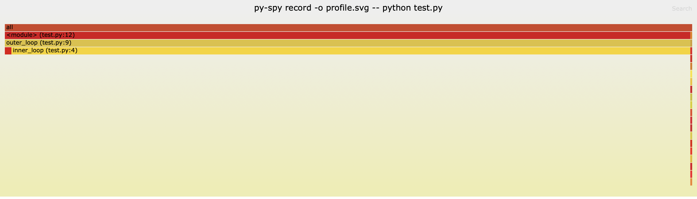
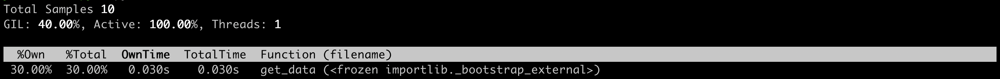

# Profiling on the Fly with Py-Spy

`py-spy` is another neat little profiling tool to have in your kit. It's used for inspecting pre-spawned processes - so there's no need for running a special workflow. Instead, it's useful for profiling things *in production*, and it can do this safely because it runs in a separate process. 

There various ways to install `py-spy`. If you're on macOS, you can use Homebrew: `brew install py-spy`. If you have Rust (which `py-spy` is programmed in) already installed, you can do: `cargo install py-spy`. But for now, let's go with our classic: `pip install py-spy`.

<div class="warning">By the way, you need root access to use this profiling method. That means some "sudo" commands!</div>

Okay, let's give it a spin! `py-spy` has three subcommands: `record`, `top`, and `dump`. Let's explore the first two. We're going to go for our split loop function script again:

```python
def inner_loop(numbers, i):
    n = len(numbers)
    for j in range(n):
        print(numbers[i], numbers[j])

def outer_loop(numbers):
    n = len(numbers)
    for i in range(n):
        inner_loop(numbers, i)

numbers = list(range(1, 1001))  # List of numbers from 1 to 1000
outer_loop(numbers)
```

If we're firing our program up from scratch, you can write something like the following:

```shell
py-spy record -o profile.svg -- python test.py
```

If you're dealing with a process that's in production, you'll need to figure out the `Process ID`. If you're on a Unix-based system, I recommend `pgrep python`. Otherwise check Task Manager. Alternatively, use `psutil` and include this snippet of code at the start of your file:

```python
import psutil

for proc in psutil.process_iter(['pid', 'name']):
    if 'python' in proc.info['name']:
        print(proc.info['pid'])
```

This means you can capture the PID when the process first spawns. Then you'll want to use the `--pid` flag, as follows:

```shell
py-spy record -o profile.svg --pid 12345
```

These will create a 🔥 flame graph 🔥 showing CPU usage!



If you use `top`, you'll get a tabular output of how the process is doing: `py-spy top -- python test.py`:

